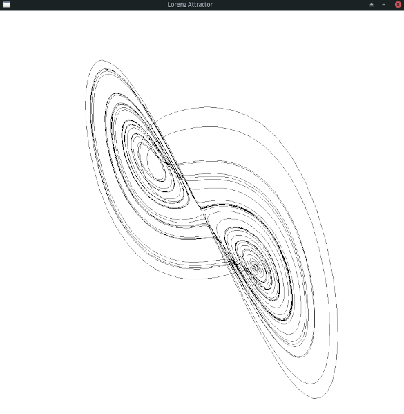

# Sunburst

Sunburst is a simple processing like framework for simple animations with multiple backends.


Your animations live within a `Sketch` that holds a user defined `SketchState`. 
The `Sketch` allows to specify a `setup`, `update` and `draw` function.

Example of a lorenz attractor:
```rust
use sunburst::{
    canvas::{Canvas, IntPoint},
    path::Path,
    renderer::RendererType::SDL2,
    sketch::{Sketch, SketchMetrics},
};

const ORIGIN: isize = 450;
const A: f32 = 10.0;
const B: f32 = 28.0;
const C: f32 = 8.0 / 3.0;
const DT: f32 = 0.01;

struct SketchState {
    x: f32,
    y: f32,
    z: f32,
    path: Path,
}

fn state_create() -> SketchState {
    let mut path = Path::new();
    path.move_to(&IntPoint::new(ORIGIN, ORIGIN));
    SketchState {
        x: 0.5,
        y: 0.05,
        z: 0.3,
        path,
    }
}

fn update(state: &mut SketchState, _: &SketchMetrics) {
    let dx = (A * (state.y - state.x)) * DT;
    let dy = (state.x * (B - state.z) - state.y) * DT;
    let dz = (state.x * state.y - C * state.z) * DT;
    state.x += dx;
    state.y += dy;
    state.z += dz;

    state.path.line_to(&IntPoint::new(
        ORIGIN + (14.0 * state.x) as isize,
        ORIGIN + (14.0 * state.y) as isize,
    ));
}

fn draw(canvas: &mut Canvas, state: &SketchState, _: &SketchMetrics) {
    canvas.clear();
    canvas.draw_path(&state.path);
}

fn main() {
    let sketch = Sketch::new(state_create, 900, 900)
        .renderer(SDL2("Lorenz Attractor"))
        .update(update)
        .draw(draw);
    sketch.run();
}
```



## TODOs

- [ ] Proper draw algorithm for ellipse
- [ ] Support for stroke weight
- [ ] Generic font rendering with user chosen fonts
- [ ] OpenCV renderer backend for video creation
- [ ] noLoop() like function
- [ ] Bezier curves
- [ ] Path closing
- [ ] Path filling (polygon filling)
- [ ] Generic lerping for all primitives
- [ ] Vector primitive
- [ ] HSL color support
- [ ] Macro for using hex colors at compile time
- [ ] Noises (perlin, simplex)
- [ ] Loading and drawing user images
- [ ] Anti aliased drawing
- [ ] Support for webcam?